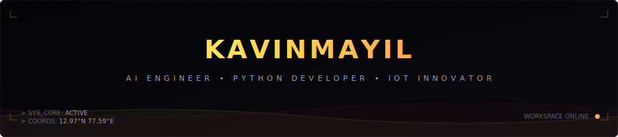

<div align="center">
<!-- Main Animated System Banner -->

<br>
<!-- Typing Dynamic Title -->

<br><br>
<!-- Centered Side-by-Side Avatar and Bio Section -->
<table align="center" border="0" cellpadding="20" cellspacing="0" style="border-collapse: collapse; border: none; background: transparent;">
  <tr style="border: none; background: transparent;">
    <td align="center" valign="middle" width="220" style="border: none; background: transparent;">
      
    </td>
    <td align="left" valign="middle" width="580" style="border: none; background: transparent;">
      <h3 style="margin-top: 0; font-family: 'Orbitron', sans-serif; color: #FFD700; letter-spacing: 1.5px; border-bottom: 2px solid #B71C1C; padding-bottom: 8px;">💻 SYSTEM CORE INITIALIZED</h3>
      <p style="font-size: 15px; line-height: 1.6; color: #E0E0E0;">
        Welcome to my workspace. I am an <strong>AI Engineer &amp; Python Developer</strong> passionate about bridging software intelligence with the physical world. I design machine learning pipelines, build robust APIs, and innovate with embedded AI and IoT architectures.
      </p>
      <p style="font-style: italic; color: #FFE259; font-weight: bold; margin: 12px 0;">
        "Build. Learn. Repeat."
      </p>
      <div style="margin-top: 15px;">
        <a href="mailto:kavinmayil123@gmail.com" style="text-decoration: none; margin-right: 8px;">
          
        </a>
        <a href="https://github.com/KavinMayil" style="text-decoration: none; margin-right: 8px;">
          
        </a>
        
      </div>
    </td>
  </tr>
</table>
</div>
---
### 🧠 Developer Profile
```python
class KavinMayil:
    def __init__(self):
        self.role = "AI Engineer"
        self.language = [
            "Python",
            "C",
            "SQL"
        ]
        self.specialization = [
            "Artificial Intelligence",
            "Machine Learning",
            "LLMs",
            "IoT",
            "Computer Vision",
            "Automation"
        ]
        self.current_focus = [
            "Large Language Models",
            "FastAPI",
            "RAG",
            "Embedded AI",
            "Cloud"
        ]
        self.status = "ONLINE"
    def motto(self):
        return "Building technology that solves real-world problems."
```
---
### 🛠️ Tech Arsenal
<p align="center">
  
</p>
---
### 🚀 Active Mission Parameters
```text
AI & Deep Learning Pipelines
Python System Automation
Large Language Model Applications (RAG / Agents)
IoT & Smart Embedded Devices
High-Performance Backend REST APIs
Computer Vision Systems (OpenCV)
Modern Data Engineering
Real-world Problem Solving
```
---
### 📊 GitHub Diagnostics & Analytics
<p align="center">
  
  
</p>
<p align="center">
  
</p>
---
### 📈 Workspace Activity Grid
<p align="center">
  
</p>
---
### 🐍 Contribution Crawler
<p align="center">
  
</p>
---
### 📡 System Diagnostics
| Diagnostic Module | Status Indicator |
| :--- | :--- |
| **Python Engine** | `ONLINE` |
| **Artificial Intelligence** | `ONLINE` |
| **Machine Learning Core** | `ONLINE` |
| **IoT Connectivity** | `ONLINE` |
| **Automation Routines** | `ONLINE` |
| **Adaptive Learning** | `ALWAYS ACTIVE` |
---
<div align="center">
### ⚡ KAVINMAYIL SYSTEMS
#### Artificial Intelligence • Python • IoT
_"Every project is another layer of intelligence in the network."_
<br>

</div>
